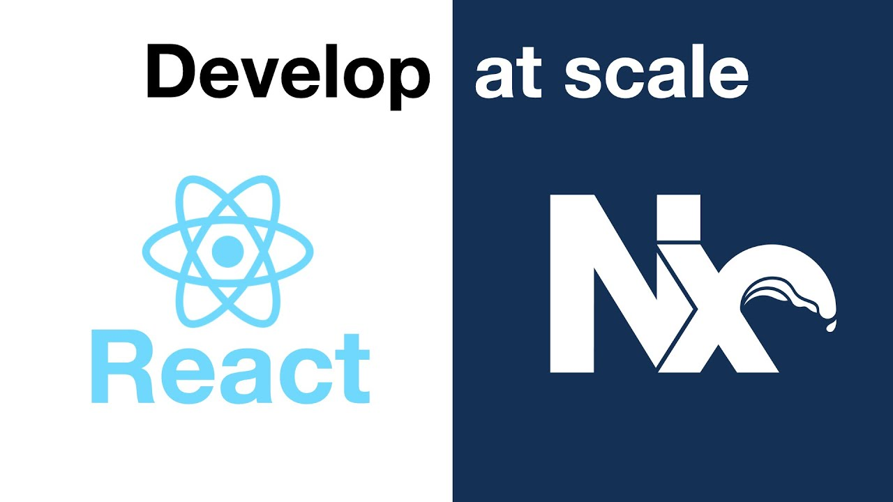
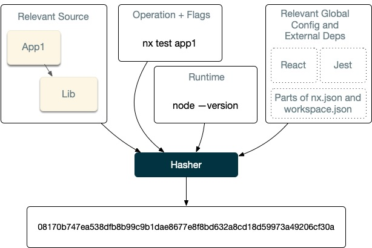
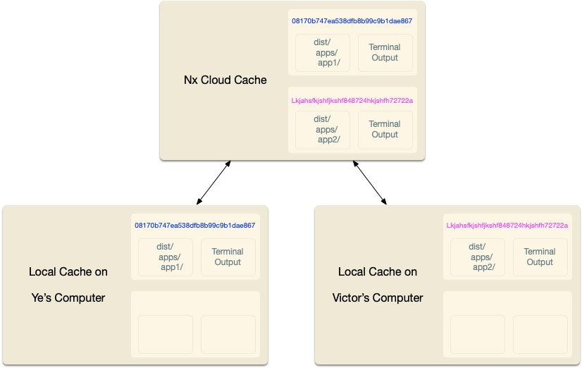

# Effective React Development with Nx



# Table of Contents

- [Effective React Development with Nx](#effective-react-development-with-nx)
- [Table of Contents](#table-of-contents)
- [Introduction](#introduction)
- [Chapter 1: Getting Started with Nx](#chapter-1-getting-started-with-nx)
  - [Creating a Nx workspace](#creating-a-nx-workspace)
  - [Nx Commands](#nx-commands)
  - [Preparing for Development](#preparing-for-development)
  - [Summary:](#summary)
- [Chapter 2: Libraries](#chapter-2-libraries)
  - [Apps and Libs](#apps-and-libs)
  - [Organizing Libraries](#organizing-libraries)
  - [Categories of Libraries](#categories-of-libraries)
  - [Feature Libs](#feature-libs)
  - [UI Libraries](#ui-libraries)
  - [GlobalStyles](#globalstyles)
  - [Button](#button)
  - [Header and Main](#header-and-main)
  - [NavigationList and NavigationItem](#navigationlist-and-navigationitem)
  - [Using the UI Libs](#using-the-ui-libs)
  - [Data-access Libs](#data-access-libs)
  - [Using the data-access lib](#using-the-data-access-lib)
  - [Summary:](#summary-1)
- [Chapter 3: Working Effectively in Monorepo](#chapter-3-working-effectively-in-monorepo)
  - [The Dependency Graph](#the-dependency-graph)
  - [Only recompute affected projects](#only-recompute-affected-projects)
  - [Computation Caching](#computation-caching)
  - [Adding the API App](#adding-the-api-app)
  - [Sharing Models between Frontend and Backend](#sharing-models-between-frontend-and-backend)
  - [Automatic Code Formatting](#automatic-code-formatting)
  - [Summary:](#summary-2)
- [Chapter 4: Bringing it all together](#chapter-4-bringing-it-all-together)
  - [Checkout API and Shared Models](#checkout-api-and-shared-models)
  - [Cart data-access Lib](#cart-data-access-lib)
  - [Managing cart State using Redux Toolkit](#managing-cart-state-using-redux-toolkit)
  - [Cart feature Lib](#cart-feature-lib)
  - [Wiring up Add Button in books Feature](#wiring-up-add-button-in-books-feature)
  - [Building for Production](#building-for-production)


# Introduction
When working at a company with more than one team, most of the times development teams are grouped by their domain or technology. 
For example, one team builds UI in React, and another one builds API in Express. 

They usually have separate code repositories, so a change in the software as a whole requires working on multiple repositories. (°ロ°)

This multi-repo style, often called "Polyrepo" causes a few glaring problems, such as:

-  Lack of collaboration, because sharing code is harder.
-  Lack of consistency in lint, test, and release (you have to keep track of a ton of config files in separate repos!)
-  Lack of mobility between projects because lack of access or different development styles
-  Difficult to coordinate changes across repos
-  In the end, it will cause lots of bugs during integration (integration hell!🔥)

**Well, is there even another way of approaching this? :(**

Surprisingly, there is! It's called monorepo!

**What the f is monorepo, anyway?**

In short, it is a single repo containing multiple projects (and even using different techs) at once!

Not only does this provide code colocation (all code, all in one place), it can also define relationships between them!

**What's in it for me, then?**

A proper monorepo approach can prevent head-bashing problems and wasted time :)

Even Google, Microsoft and React use monorepo! Sooo let's just dive right into it!

<br>

# Chapter 1: Getting Started with Nx

Before we go anywhere, let's define some things first. 😀

- **Workspace** is a folder which contains apps and libraries. Simply, the whole repo.
- **Project** is an app or library within the Workspace.
- **Application** is something that you want to develop
- **Library** is a set of files to deal with something specific, like parsing json or centering a div :D 

## Creating a Nx workspace
Make sure you have NodeJS already installed, and run

```npx create-nx-workspace@13.3.0```

If it asks you to install something, just press Y and enter. 

It will look something like this.


For **workspace** name, i will use `zeroone`. and for the preset, pick `react`. 

You will be prompted for the **application** name and styling format. Let's use `bookstore` as the app name and `styled-components` for styling.


Nx asks you to set up Nx Cloud. It supposedly provides cloud-enhanced features, but we aren't going to worry about that for now.


After a couple of moments, Nx should finish creating the workspace and we will end up with something like this. 

<details>
<summary>Generated Folder Tree (click me!)</summary>

```
.
├── apps
│ ├── bookstore
│ │ ├── src
│ │ ├── jest.config.js
│ │ ├── project.json
│ │ ├── tsconfig.app.json
│ │ ├── tsconfig.json
│ │ └── tsconfig.spec.json
│ └── bookstore-e2e
│ ├── src
│ ├── cypress.json
│ ├── project.json
│ └── tsconfig.json
├── libs
├── babel.config.json
├── jest.config.js
├── jest.preset.js
├── README.md
├── nx.json
├── package-lock.json
├── package.json
├── tools
│ ├── generators
│ └── tsconfig.tools.json
├── tsconfig.base.json
└── workspace.json
```

</details>

---

The `apps` folder contains the code of all apps, inside of which 2 has been created by default right now: 
- The `bookstore` app, and 
- `bookstore-e2e`, which is its end-to-end (e2e) tests using Cypress.

The `libs` folder contains our libraries, currently empty. 🍃

The `tools` folder can be used for scripts that are workspace-specific.

The `nx.json` file configures Nx.

Aaand to start the app, type in `npm start` to the terminal.

This will start the `bookstore` app and you can open it at [http://localhost:4200](http://localhost:4200) 

We are greeted with a welcome page, yaay! 🥳


## Nx Commands

Targets are tasks or commands that can be invoked or ran on the project. Call it with `nx [target] [project]`!

For example, in our `bookstore` app, we can run these targets.

```sh
# Serve the app
npx nx serve bookstore

# Build the app
npx nx build bookstore

# Run a linter for the application
npx nx lint bookstore

# Run unit tests for the application
npx nx test bookstore

# Run e2e tests for the application
npx nx e2e bookstore-e2e

# You can also see the dependency graph of our workspace
npx nx dep-graph
```

Give it a try!

**Hold on a sec, what is npx? do you mean npm?**

Noo, it is not a typo :)

`npx` is a way to run scripts, and since Nx generators are basically scripts, you use `npx`. You can also install Nx globally if you are annoyed of typing npx everytime🤣

If you want to read more about advanced Nx stuff, click below! 
(might require quite a bit of knowledge though, be warned ._. )

Or else you can just skip them :)

<details>
<summary><b>Nx Workspace Configs</b></summary>

Nx is built in a modular fashion, and gives you a lot of foundation such as dependency graph calculation, running generators and migrations, computation caching, and also a set of plugins to provide technology specific features, which provides you to gradually dive deeper into Nx features.

Nx provides specific config files:
- `nx.json` which is at the root of the workspace and to configure Nx CLI (set defaults for projects and code scaffolding, workspace layout, task runner, and computation cache configs)
- `workspace.json` is also at the root of the workspace is optional and can be used to list the projects in your workspace explicitly, instead of having Nx scan it for you.
- `project.json` is at the root of every project, which contains specific metadata and "targets" or tasks that can be ran on the project. Such as `build`, `serve`, `lint`, `test` and can be configured however you see fit.

</details>

<details>
<summary><b>Installing Nx globally</b></summary>

If you don't want to type in `npx` for every command, you can install Nx globally with 

`npm install -g @nrwl/cli`

And check that it installed properly with `nx --version`

So, next time you run a command, you only need to type in `nx ...` without the `npx`.

</details>

---

## Preparing for Development

Let's end this chapter by removing the generated content from the `bookstore` app and adding some configs to the workspace.

Open up your favorite code editor and modify these three files.

**apps/bookstore/src/app/app.tsx**
```js
import styled from 'styled-components';

const StyledApp = styled.div``;

export const App = () => {
  return (
    <StyledApp>
      <header>
        <h1>Bookstore</h1>
      </header>
    </StyledApp>
  );
}

export default App;
```

**apps/bookstore/src/app/app.spec.tsx**
```js
import { getGreeting } from '../support/app.po';

describe('bookstore', () => {
  beforeEach(() => cy.visit('/'));

  it('should display welcome message', () => {
    getGreeting().contains('Bookstore');
  });
});
```

**apps/bookstore-e2e/src/integration/app.spec.ts**
```js
import { getGreeting } from '../support/app.po';

describe('bookstore', () => {
  beforeEach(() => cy.visit('/'));

  it('should display welcome message', () => {
    getGreeting().contains('Bookstore');
  });
});
```

Make sure the tests still pass:
- `npx nx lint bookstore`
- `npx nx test bookstore`
- `npx nx e2e bookstore-e2e`

If you serve the app again ([at http://localhost:4200](http://localhost:4200)) you will end up with something like this: 


It's a bookstore alright. Might not look great, but hey, you made some progress! 🤩

Also, it's a good idea to commit your code before making any more changes. So you can keep track of your progress and can rollback if anything goes south :D

```sh
git add .
git commit -m 'end of chapter one'
```

## Summary:

A typical Nx *workspace* consists of two types of projects: *applications* and *libraries*.

A newly created workspace comes with a set of targets we can run on the generated application: `lint`, `test`, and `e2e`.

Nx also has a tool for displaying the *dependency graph* of all the projects within the workspace.

<br>

# Chapter 2: Libraries

Now that we have a skeleton of the app, we can start adding to our app by creating and using *libraries*!

Before that though, let's understand a little more about the concept of libraries.

## Apps and Libs

As alluded to before, a typical Nx workspace contains "apps" and "libs". This separation helps facilitate more modular systems, incentivising organisation of your source code and logic into smaller and focused units.

Nx helps you create TypeScript mappings for libraries, so using it is as simple as usual libs, without any `../../../../` kerfuffle :)

```js
// Example of importing a Button from custom libs
import { Button } from '@zeroone/ui'
```

Each library contains an `index.ts` barrel file, or "public API" to help you expose what can be used by others in a library.

A common mental model is to see apps as "containers" that link and bundle functionalities implemented in libraries together. Follow an 80/20 approach: place 80% of your logic in libs, and 20% in apps.

**B-But why should i make libraries? does it not slow down development time?**

Actually no, the "libraries" you make is consumed by the app directly. It's basically just moving the code and grouping them into libs. So, no development time should be lost.

As an added bonus, you can also share these across projects, publish them or reuse them after :)

**Then my custom libraries should be general-purpose, no?**

Not really, you can still make it really lean and focused. It just helps to organize things a bit.

## Organizing Libraries

When organizing libs, you should think about your business domains, and structure them into subfolders, which Nx supports!

```
.
├── (...)
├── libs
│ └── books
│ │ └── feature
│ │ │ ├── src
│ │ │ ├── ...
│ │ │ └── ...
│ │ └── ui
│ │ ├── src
│ │ ├── ...
│ │ └── ...
│ └── ui
│ ├── src
│ ├── ...
│ └── ...
└── (...)
```

Note that we have two "ui" libs, but they are separated! 
The one outside are common UI components that can be reused anywhere, but one at `books/ui` is specific to `books` domain and best not to be used outside of it.

This structure helps organize your workspace and apply code ownership that we will see later.

## Categories of Libraries

In a workspace, libs are commonly divided like this:

- **Feature** implements "smart" UI that is stateful/effectful, handles routing, connected to data source, etc.) for specific **business use cases**.
- **UI** contains only **presentational** components that render purely from their props and functions that are passed down.
- **Data-access** contain the means of interacting with external data services, usually backends.
- **Utility** are common utilites that can be shared by many projects.

**This is too much, why not just name everything clearly and call it a day?**

Well, this scheme helps to set boundaries of what a lib should and should not do. It also helps understand the capabilites of each libs, and how they interact.

## Feature Libs

You can generate new apps, components, libs, and more using `nx generate` or its alias, `nx g`.

So, let's try creating one!

```sh
npx nx g lib feature \
--directory books \
--appProject bookstore \
--tags type:feature,scope:books
```

**Whoa, what is THAT command?**

Calm down, i will explain it.

- `nx g lib` is a way to generate libraries, the Nx way😎, and we will make a `feature` lib.
- `--directory` means we will save it into `libs/books/feature`.
- `--appProject` tells Nx to put it into the `bookstore` app. This will help you generate routes, adding `BrowserRouter` and adding `react-router-dom`, auto*magically*✨.
- `--tags` lets you annotate apps and libs, and can be used to scope or constrain usage, we will see it later.

After it completes, you will see the new directory.

```
.
├── (...)
├── libs
│ └── books
│ └── feature
│ ├── src
│ │ ├── index.ts
│ │ └── lib
│ ├── jest.config.js
│ ├── project.json
│ ├── README.md
│ ├── tsconfig.json
│ ├── tsconfig.lib.json
│ └── tsconfig.spec.json
└── (...)
```

Nx generates our library with some default code and its scaffolding for linting (ESLint) and testing (Jest). Try running them with

```sh
npx nx lint books-feature
npx nx test books-feature
```

Oh yeah, did you notice that? Nx actually helps you scope the libs! books(directory) - feature(category)

Anyway, Nx also updates the `bookstore`'s App component in `apps/bookstore/src/app/app.tsx` auto*magically*! :D

<details>
<summary><b>apps/bookstore/src/app/app.tsx</b></summary>

```js
import styled from 'styled-components';

import { Route, Link } from 'react-router-dom';

import { BooksFeature } from '@zeroone/books/feature';

const StyledApp = styled.div``;

export const App = () => {
  return (
    <StyledApp>
      <header>
        <h1>Bookstore</h1>
      </header>
      {/* START: routes */}
      {/* These routes and navigation have been generated for you */}
      {/* Feel free to move and update them to fit your needs */}
      <br />
      <hr />
      <br />
      <div role="navigation">
        <ul>
          <li>
            <Link to="/">Home</Link>
          </li>
          <li>
            <Link to="/feature">BooksFeature</Link>
          </li>
          <li>
            <Link to="/page-2">Page 2</Link>
          </li>
        </ul>
      </div>
      <Route
        path="/"
        exact
        render={() => (
          <div>
            This is the generated root route.{' '}
            <Link to="/page-2">Click here for page 2.</Link>
          </div>
        )}
      />
      <Route path="/feature" component={BooksFeature} />
      <Route
        path="/page-2"
        exact
        render={() => (
          <div>
            <Link to="/">Click here to go back to root page.</Link>
          </div>
        )}
      />
      {/* END: routes */}
    </StyledApp>
  );
};

export default App;
```

</details>

---

The `main.tsx` is updated as well!

<details>
<summary><b>apps/bookstore/src/main.tsx</b></summary>

```js
import { StrictMode } from 'react';
import * as ReactDOM from 'react-dom';

import App from './app/app';

import { BrowserRouter } from 'react-router-dom';

ReactDOM.render(
  <StrictMode>
    <BrowserRouter>
      <App />
    </BrowserRouter>
  </StrictMode>,
  document.getElementById('root')
);

export default App;
```

</details>

---

Try restarting the development server again (`npx nx serve bookstore`), and you will see the updated app!


Uhhhh alright, it has some style to it. Not good enough though. So let's add a component lib to provide better styles, eh?

## UI Libraries

```sh
npx nx g lib ui \
--tags type:ui,scope:books \
--no-interactive
```

Again, we will create a `ui` library with these tags, and `--no-interactive` simply means "don't ask me anything, use the default."

Oh, a new folder popped up (～￣▽￣)～ (at `libs/ui`).

```
zeroone
├── (...)
├── libs
│ ├── (...)
│ ├── ui
│ │ ├── src
│ │ │ ├── lib
│ │ │ └── index.ts
│ │ ├── .eslintrc
│ │ ├── jest.config.js
│ │ ├── README.md
│ │ ├── tsconfig.app.json
│ │ ├── tsconfig.json
│ │ └── tsconfig.spec.json
└── (...)
```

It does nothing yet, so let's add some components!

```sh
npx nx g component GlobalStyles --project ui --export --tags type:ui,scope:books

npx nx g component Button --project ui --export --tags type:ui,scope:books

npx nx g component Header --project ui --export --tags type:ui,scope:books

npx nx g component Main --project ui --export --tags type:ui,scope:books

npx nx g component NavigationList --project ui --export --tags type:ui,scope:books

npx nx g component NavigationItem --project ui --export --tags type:ui,scope:books
```

That was a lot. Let me explain.

We created a couple of components (GlobalStyles, Button, Header, etc.) inside the `ui` project, exported it to `index.ts`, and with specified tags.

The `--exports` isn't strictly necessary, though. If you forgot about it, you can add it manually into the `index.ts`.

If you want to mess around and learn more about the Nx commands, try adding `--help` like `npx nx g component --help`, or `npx nx g app --help`

Let's go over what each component does.

## GlobalStyles

This component will inject a global stylesheet (css) into the app when used. Can be useful to override global style rules like `body { margin 0; }`

**libs/ui/src/lib/global-styles/global-styles.tsx**

```js
import { createGlobalStyle } from 'styled-components';

export const GlobalStyles = createGlobalStyle`
  body {
    margin: 0;
    font-size: 16px;
    font-family: sans-serif;
  }

  * {
    box-sizing: border-box;
  }
`;

export default GlobalStyles;
```

## Button

It's a styled button. It does what it says and passes props down to the actual \<button\> element.

**libs/ui/src/lib/button/button.tsx**

```js
import { ButtonHTMLAttributes } from 'react';
import styled from 'styled-components';

const StyledButton = styled.button`
  font-size: 0.8rem;
  padding: 0.5rem;
  border: 1px solid #ccc;
  background-color: #fafafa;
  border-radius: 4px;

  &:hover {
    background-color: #80a8e2;
    border-color: #0e2147;
  }
`;

export const Button = ({
  children,
  ...rest
}: ButtonHTMLAttributes<HTMLButtonElement>) => {
  return <StyledButton {...rest}>{children}</StyledButton>;
};

export default Button;
```

## Header and Main

These are used for layout. Header component is the header bar, and the Main takes up the rest of the page.

**libs/ui/src/lib/header/header.tsx**

```js
import { HTMLAttributes } from 'react';
import styled from 'styled-components';

const StyledHeader = styled.div`
  padding: 1rem;
  background-color: #2657ba;
  color: white;
  display: flex;
  align-items: center;
  a {
    color: white;
    text-decoration: none;
    &:hover {
      text-decoration: underline;
    }
  }
  > h1 {
    margin: 0 1rem 0 0;
    padding-right: 1rem;
    border-right: 1px solid white;
  }
`;

export const Header = (props: HTMLAttributes<HTMLElement>) => (
  <StyledHeader>{props.children}</StyledHeader>
);

export default Header;
```

**libs/ui/src/lib/main/main.tsx**

```js
import { HTMLAttributes } from 'react';
import styled from 'styled-components';

const StyledMain = styled.main`
  padding: 0 1rem;
  width: 100%;
  max-width: 960px;
`;

export const Main = (props: HTMLAttributes<HTMLElement>) => (
  <StyledMain>{props.children}</StyledMain>
);

export default Main;
```

## NavigationList and NavigationItem

And lastly, NavigationList will render the navbar inside Header component, and NavigationItem will render items inside NavigationList.

**libs/ui/src/lib/navigation-list/navigation-list.tsx**

```js
import { HTMLAttributes } from 'react';
import styled from 'styled-components';

const StyledNavigationList = styled.div`
  ul {
    display: flex;
    margin: 0;
    padding: 0;
    list-style: none;
  }
`;

export const NavigationList = (props: HTMLAttributes<HTMLElement>) => {
  return (
    <StyledNavigationList role="navigation">
      <ul>{props.children}</ul>
    </StyledNavigationList>
  );
};

export default NavigationList;
```

**libs/ui/src/lib/navigation-item/navigation-item.tsx**

```js
import { LiHTMLAttributes } from 'react';
import styled from 'styled-components';

const StyledNavigationItem = styled.li`
  margin-right: 1rem;
`;

export const NavigationItem = (props: LiHTMLAttributes<HTMLLIElement>) => {
  return <StyledNavigationItem>{props.children}</StyledNavigationItem>;
};

export default NavigationItem;
```

## Using the UI Libs

Now we can use the libs inside our `bookstore` app.

```js
import { Link, Redirect, Route } from 'react-router-dom';
import { BooksFeature } from '@zeroone/books/feature';

// importing the UI library into our App
import {
  GlobalStyles,
  Header,
  Main,
  NavigationItem,
  NavigationList
} from '@zeroone/ui';

export const App = () => {
  return (
    <>
      <GlobalStyles />
      <Header>
        <h1>Bookstore</h1>
        <NavigationList>
          <NavigationItem>
            <Link to="/books">Books</Link>
          </NavigationItem>
        </NavigationList>
      </Header>
      <Main>
        <Route path="/books" component={BooksFeature} />
        <Route exact path="/" render={() => <Redirect to="/books" />} />
      </Main>
    </>
  );
};

export default App;
```

Finally, let's restart our server (`npx nx serve bookstore`) and we will see the improved UI! :D


Looks great! Let's save our progress.

```sh
git add .
git commit -m 'add books feature and ui components'
```

## Data-access Libs

We want to fetch data from *somewhere* and display it to our books feature. And to do that, we need a data-access lib.

`npx nx g @nrwl/web:lib data-access --directory books --tags type:data-access,scope:books`

**What is that `@nrwl/web:lib` doing? why not just `lib` ?**

Because we want to run it in web browser, and not necessarily in React or any specific framework. So we specifically use the `lib` generator from `@nrwl/web`.

We previously not use any prefix because inside `nx.json`, `@nrwl/react` *is* the default generator.

Back on track, a new directory popped up, again! :D

Let's open and edit the books-data-access.tsx file.

**libs/books/data-access/src/lib/books-data-access.ts**

```js
export async function getBooks() {
  // TODO: We'll wire this up to an actual API later.
  // For now we are just returning some fixtures.
  return [
    {
      id: 1,
      title: 'The Picture of Dorian Gray',
      author: 'Oscar Wilde',
      rating: 3,
      price: 9.99
    },
    {
      id: 2,
      title: 'Frankenstein',
      author: 'Mary Wollstonecraft Shelley',
      rating: 5,
      price: 7.95
    },
    {
      id: 3,
      title: 'Jane Eyre',
      author: 'Charlotte Brontë',
      rating: 4,
      price: 10.95
    },
    {
      id: 4,
      title: 'Dracula',
      author: 'Bram Stoker',
      rating: 5,
      price: 14.99
    },
    {
      id: 5,
      title: 'Pride and Prejudice',
      rating: 4,
      author: 'Jane Austen',
      price: 12.85
    }
  ];
}

export default getBooks;
```

## Using the data-access lib

Now let's use the `getBooks` function in out `books` feature. We can do this using `useEffect` and `useState`.

**libs/books/feature/src/lib/books-feature.tsx**

```js
import { useEffect, useState } from 'react';
import styled from 'styled-components';
import { getBooks } from '@zeroone/books/data-access';
import { Books } from '@zeroone/books/ui';

export const BooksFeature = () => {
  const [books, setBooks] = useState<any[]>([]);
  useEffect(() => {
    getBooks().then(setBooks);
  }, [
    // This effect runs only once on first component render
    // so we declare it as having no dependent state.
  ]);
  return (
    <>
      <h2>Books</h2>
      <Books books={books} />
    </>
  );
};

export default BooksFeature;
```

You may notice we're using two new components, `Books` and `Book`. Create them with:

```sh
npx nx g lib ui --directory books
npx nx g component Books --project books-ui --export
npx nx g component Book --project books-ui --export
```

We put *presentational* components in their own UI libs. This is to prevent side-effects bleeding into them, making it easier to understand and test.

We use `libs/books/ui` instead of `libs/ui` because we should only use those components in `books` context, and it's not general-purpose. 

**libs/books/ui/src/lib/books/books.tsx**

```js
import styled from 'styled-components';
import { Book } from '../book/book';

export interface BooksProps {
  books: any[];
}

const StyledBooks = styled.div`
border: 1px solid #ccc;
border-radius: 4px;
`;

export const Books = ({ books }: BooksProps) => {
  return (
    <StyledBooks>
      {books.map(book => (
        <Book key={book.id} book={book} />
      ))}
    </StyledBooks>
  );
};

export default Books;
```

**libs/books/ui/src/lib/book/book.tsx**

```js
import styled from 'styled-components';
import { Button } from '@zeroone/ui';

export interface BookProps {
  book: any;
}

const StyledBook = styled.div`
display: flex;
align-items: center;
border-bottom: 1px solid #ccc;
&:last-child {
border-bottom: none;
}
> span {
padding: 1rem 0.5rem;
margin-right: 0.5rem;
}
.title {
flex: 1;
}
.price {
color: #478d3c;
}
`;

export const Book = ({ book }: BookProps) => {
  return (
    <StyledBook>
      <span className="title">
        {book.title} by <em>{book.author}</em>
      </span>
      <span className="price">${book.price}</span>
    </StyledBook>
  );
};

export default Book;
```

Restart the server to check out our new feature in action!


Looks good!! 🤩

Now you might realize there were a couple problems.

1. `getBooks` just returns a fixed, hardcoded response (a stub) and does not call out to a backend service.
2. We use `any` types when dealing with books data ( `getBooks` returns `any[]` and `BookProps` is `{ book: any }` ). A better way to deal with this is to enforce type definitions, to prevent bugs and generally makes developing easier :D
  
If you want to read about scoping and bounding modules usage with tags, read below! 

<details>
<summary><b>Enforcing Module Boundaries</b></summary>

We generated our libs using `--tags` option to define a type and scope for them! They can be used to define and enforce clean separation of concerns.

Open `.eslintrc.json` at the root of your workspace. You should see something like this.

```json
"@nrwl/nx/enforce-module-boundaries": [
          "error",
          {
            "depConstraints": [
              {
                "sourceTag": "*",
                "onlyDependOnLibsWithTags": [
                  "*"
                ]
              }
            ],
            "allow": [],
            "enforceBuildableLibDependency": true
          }
        ]
```

The `depConstraints` can be used to fine-tune boundaries. It is currently set to `*` which allows anything to use everything.

The `allow` array is a whitelist to omit any further checks.

`enforceBuildableLibDependency` prevents importing a non-buildable lib into a buildable one.

**Using Tags to Enforce Boundaries**

As we recall earlier, we have apps and 4 categories of libs. Let's define their boundaries.

1. `Applications` should be able to depend on any libs, but not other apps.
2. `Feature` libs can depend on any other libs.
3. `Data-access` libs should only depend on other Data-access or Utility libs.
4. `UI` libs can only depend on other UI or Utility libs.
5. `Utility` libs can only depend on other Utility libs.

Now, let's configure the ESLint Rule.

```json
"@nrwl/nx/enforce-module-boundaries": [
          "error",
          {
          "depConstraints": [
              {
                "sourceTag": "type:app",
                "onlyDependOnLibsWithTags": [
                  "type:feature",
                  "type:ui",
                  "type:util"
                ]
              },
              {
                "sourceTag": "type:feature",
                "onlyDependOnLibsWithTags": [
                  "type:feature",
                  "type:ui",
                  "type:util"
                ]
              },
              {
                "sourceTag": "type:data-access",
                "onlyDependOnLibsWithTags": [
                  "type:data-access",
                  "type:util"
                ]
              },
              {
                "sourceTag": "type:ui",
                "onlyDependOnLibsWithTags": [
                  "type:ui",
                  "type:util"
                ]
              },
              {
                "sourceTag": "type:util",
                "onlyDependOnLibsWithTags": [
                  "type:util"
                ]
              }
            ]
          }
        ]
```

Also, we have a second dimension to our tags. (`--tags scope:books`) which allows separation into logical domains.

If we want to add an *admin* app to manage books, we can use `--tags type:app,scope:admin`. There is likely some shared libs required by both admin and books app. To do that, we generate libs with `--tags type:ui,scope:shared`.

And set boundaries like:
- `Book` apps and libs can only depend on scope:books libs.
- `Admin` apps and libs can only depend on scope:admin libs.
- Any apps and libs can depend on scope:shared libs.

```json
"@nrwl/nx/enforce-module-boundaries": [
          "error",
          {
          ...
          "depConstraints": [
              {
                "sourceTag": "type:app",
                "onlyDependOnLibsWithTags": [
                  "type:feature",
                  "type:ui",
                  "type:util"
                ]
              },
          ...
          {
                "sourceTag": "scope:books",
                "onlyDependOnLibsWithTags": [
                  "scope:shared",
                  "scope:books"
                ]
              },
              {
                "sourceTag": "scope:admin",
                "onlyDependOnLibsWithTags": [
                  "scope:shared",
                  "scope:admin"
                ]
              },
              {
                "sourceTag": "scope:shared",
                "onlyDependOnLibsWithTags": [
                  "scope:shared"
                ]
              }
            ]
          }
        ]
```

By forbidding cross-scope dependencies, we can prevent a feature from `admin` leaking into `books` app, and it can be safely guarded.

These module boundaries are going to be needed as the workspace grows, otherwise projects **will** become unmanageable :(

You can also add `platform:web, platform:node, etc.` tags if you have a multi-platform monorepo.

</details>

---

Finally, let's commit our changes before moving on :D

```sh
git add .
git commit -m 'implement books feature and link to application'
```

## Summary:
- Libs have 4 types: `feature`, `UI`, `data-access`, and `utility`.
- Use `nx g ...` to create libs from scratch.
- When running `nx g ...` we can use other generators like `@nrwl/web:lib` to set up a lib from specific collection rather than the one default in `nx.json`
- Nx can enforce module boundaries through tags inside ESLint `@nrwl/nx/enforce-module-boundaries` rule. 

# Chapter 3: Working Effectively in Monorepo

We have created a `bookstore` app that lists books for users to purchase. Now we will explore how Nx helps us work effectively.

## The Dependency Graph

As we've seen, Nx can generate a dependency graph. Let's look at it now! 

`npx nx dep-graph`


You can hover over a lib or app to see its dependencies. Neat, right? 

## Only recompute affected projects

Let's say we add a checkout button to each books in the list. Let's update our `Book`, `Books`, and `BooksFeature` components.

**libs/books/ui/src/lib/book/book.tsx**

```js
import styled from 'styled-components';
import { Button } from '@zeroone/ui';

/* eslint-disable-next-line */
export interface BookProps {
  book: any;
  // new prop
  onAdd: (book: any) => void;
}

const StyledBook = styled.div`
  display: flex;
  align-items: center;
  border-bottom: 1px solid #ccc;
  &:last-child {
    border-bottom: none;
  }
  > span {
    padding: 1rem 0.5rem;
    margin-right: 0.5rem;
  }
  .title {
    flex: 1;
  }
  .rating {
    color: #999;
  }
  .price {
    color: #478d3c;
  }
`;

export const Book = ({ book, onAdd }: BookProps) => {
  const handleAdd = () => onAdd(book);
  return (
    <StyledBook>
      <span className="title">
        {book.title} by <em>{book.author}</em>
      </span>
      <span className="rating">{book.rating}</span>
      <span className="price">${book.price}</span>
      {/* Add button to UI */}
      <span>
        <Button onClick={handleAdd}>Add to Cart</Button>
      </span>
    </StyledBook>
  );
};

export default Book;
```

**libs/books/ui/src/lib/books/books.tsx**

```js
import styled from 'styled-components';
import { Book } from '../book/book';

export interface BooksProps {
  books: any[];
  // New prop
  onAdd: (book: any) => void;
}

const StyledBooks = styled.div`
  border: 1px solid #ccc;
  border-radius: 4px;
`;

export const Books = ({ books, onAdd }: BooksProps) => {
  return (
    <StyledBooks>
      {books.map((book) => (
        // Pass down new callback prop
        <Book key={book.id} book={book} onAdd={onAdd} />
      ))}
    </StyledBooks>
  );
};

export default Books;
```

**libs/books/feature/src/lib/books-feature.tsx**

```js
import { useEffect, useState } from 'react';
import styled from 'styled-components';
import { getBooks } from '@zeroone/books/data-access';
import { Books } from '@zeroone/books/ui';

export const BooksFeature = () => {
  const [books, setBooks] = useState<any[]>([]);
  useEffect(
    () => {
      getBooks().then(setBooks);
    },
    [
      // This effect runs only once on first component render
      // so we declare it as having no dependent state.
    ]
  );
  return (
    <>
      <h2>Books</h2>
      {/* Pass a stub callback for now */}
      {/* We'll implement this properly in Chapter 4 */}
      <Books books={books} onAdd={(book) => alert(`Added ${book.title}`)} />
    </>
  );
};
export default BooksFeature;
```

Nx not only understands how projects relate, but can also determine which projects were affected by a change. We can see this by prepending "affected" to a command.

`npx nx affected:dep-graph`


Any projects dependent on the change is highlighted in red. Welp, i think i changed everything. Oh well.

But there is **more**. We can also use other commands only against the affected projects. So we can only re-test, re-lint or re-build what's changed.

```sh
# build only the affected apps
npx nx affected:build
# run unit tests on affected projects
npx nx affected:test
# run linting on affected projects
npx nx affected:lint
# run e2e tests on affected projects
npx nx affected:e2e
# Lists affected apps
npx nx affected:apps
# Lists affected libs
npx nx affected:libs
```

Nx runs these tasks in parallel to make it run blazing fast ⚡

You can set the amount of parallel tasks using `--maxParallel` flag. (3 by default)

Also, the `affected:*` command compares HEAD to a branch, `main` by default. You can set it by passing `--base` flag, or setting `defaultBase` in nx.json.

Uhhh, you might have tried testing the changes and they broke. I'm not going to judge you for it. You might want to fix it, but i won't 😎

## Computation Caching

When you adopt a monorepo and the size grows, you have to think about scaling. Re-building an entire whackload of code every single time might not be time-efficient to say the least.

So, Nx uses a computation cache. Basically, if you run any task, Nx will **remember** it. If nothing really changed next time you run the same command, it will just spit the same output, almost instantly.

By "nothing really changed" i mean its affected source files, deps, configs, versions, runtime values, or CLI flags. 



You can customize it for specific needs, like linting only checks source code and configs.

Try running unit tests for `books-feature`. Run it twice, and you will see that you will fail the second time, blazingly fast 😎⚡

The cache is stored in `node_modules/.cache/nx` folder. You can configure it in `nx.json`, under `taskRunnerOptions` field.

But not only locally, Nx can also store the cache remotely using Nx Cloud. Oh, so **that's** what it's about.



Basically, if somebody else fails a unit test on the same code.. you will also fail, but **faster**. 😂

## Adding the API App

Now let's get practical again. Commit your changes because it's about to get real. 

```sh
git add .
git commit -m 'added checkout button'
```

So far, our `bookstore` app has not communicated with a backend service. Let's make one using Express.

Install the `@nrwl/express` collection first.

`npm install --save-dev @nrwl/express`

Then, run it!

```sh
npx nx g @nrwl/express:app api \
--no-interactive \
--frontend-project=bookstore \
```

`--frontend-project` will add a proxy config to the `bookstore` app so requests to `/api/*` will be forwarded to the API.

Let's start it!

`npx nx serve api`

Open [http://localhost:3333/api](http://localhost:3333/api) or [http://localhost:4200/api](http://localhost:4200/api) and see it in action!


Nice, it works! Let's implement `/api/books` to use it in our data-access lib.

**apps/api/src/main.ts**

```js
/**
 * This is not a production server yet!
 * This is only a minimal backend to get started.
 */

import * as express from 'express';
import { IBook, ICart } from '@zeroone/shared-models';
import path = require('path');

const app = express();

app.get('/api', (req, res) => {
  res.send({ message: 'Welcome to api!' });
});

app.get('/api/books', (req, res) => {
  const books: IBook[] = [
    {
      id: 1,
      title: 'The Picture of Dorian Gray ',
      author: 'Oscar Wilde',
      rating: 5,
      price: 9.99,
    },
    {
      id: 2,
      title: 'Frankenstein',
      author: 'Mary Wollstonecraft Shelley',
      rating: 4,
      price: 7.95,
    },
    {
      id: 3,
      title: 'Jane Eyre',
      author: 'Charlotte Brontë',
      rating: 4.5,
      price: 10.95,
    },
    {
      id: 4,
      title: 'Dracula',
      author: 'Bram Stoker',
      rating: 4,
      price: 14.99,
    },
    {
      id: 5,
      title: 'Pride and Prejudice',
      author: 'Jane Austen',
      rating: 4.5,
      price: 12.85,
    },
  ];
  res.send(books);
});

app.post('/api/checkout', (req, res) => {
  const cart: ICart = req.body;
  console.log('Checking out...', JSON.stringify(cart, null, 2));
  res.send({ order: '12345678' });
  });

const port = process.env.port || 3333;
const server = app.listen(port, () => {
  console.log(`Listening at http://localhost:${port}/api`);
});

// Serve built frontend app
app.use(express.static(path.join(__dirname, '../bookstore')))
// Handle browser-side routes
app.get('*', function(req, res) {
res.sendFile('index.html', {root: path.join(__dirname, '../bookstore')});
});

server.on('error', console.error);
```

And let's update our data-access lib.

**libs/books/data-access/src/lib/books-data-access.ts**

```js
import { IBook } from '@zeroone/shared-models';

export async function getBooks() {
  const data = await fetch('/api/books', {
    headers: {
      'Content-Type': 'application/json',
    },
  });
  return data.json();
}
export default getBooks;
```

Then, restart both apps. (`npx nx serve api` and `npx nx serve bookstore`), or... 

protip: run both! Use `npx nx run-many --target=serve --projects=api,bookstore`

We will see that our app still works! (hopefully...) and we can verify that `/api/books` is being called.


Commit it because it works!

```sh
git add .
git commit -m 'added api app'
```

## Sharing Models between Frontend and Backend

We've been using `any` types, this is a bad practice as it may lead to uncaught type errors in production :(

A better idea is to create a utility lib with shared models!

`npx nx g @nrwl/node:lib shared-models --no-interactive`

**libs/shared-models/src/lib/shared-models.ts**

```js
export interface IBook {
  id: number;
  title: string;
  author: string;
  rating: number;
  price: number;
}
```

And change these five files to use the new model:

**apps/api/src/main.ts**

```js
import { IBook } from '@zeroone/shared-models';
// ...

app.get('/api/books', (req, res) => {
  const books: IBook[] = [
  // ...
  ];
  res.send(books);
});

// ...
```

**libs/books/data-access/src/lib/books-data-access.ts**

```js
import { IBook } from '@zeroone/shared-models';

// Add correct type for the return value
export async function getBooks(): Promise<IBook[]> {
  const data = await fetch('http://localhost:3333/api/books');
  return data.json();
}
```

**libs/books/feature/src/lib/books-feature.tsx**

```js
// ...
import { IBook } from '@zeroone/shared-models';

export const BooksFeature = () => {
  // Properly type the array
  const [books, setBooks] = useState<IBook[]>([]);
  // ...
  return (
    <>
      <h2>Books</h2>
      <Books books={books} onAdd={book => alert(`Added ${book.title}`)} />
    </>
  );
};

export default BooksFeature;
```

**libs/books/ui/src/lib/books/books.tsx**

```js
// ...
import { IBook } from '@zeroone/shared-models';
// Replace any with IBook
export interface BooksProps {
  books: IBook[];
  onAdd: (book: IBook) => void;
}

// ...

export default Books;
```

**libs/books/ui/src/lib/book/book.tsx**

```js
// ...
import { IBook } from '@zeroone/shared-models';

// Replace any with IBook
export interface BookProps {
  book: IBook;
  onAdd: (book: IBook) => void;
}

// ...

export default Book;
```

Run dep-graph again and you will see something like this.


Using Nx, we created a shared model lib and refactored both sides blazingly fast😎

...ok i should stop using that word

Anyway, we can also check these changes in a single commit!

```sh
git add .
git commit -m 'add shared models'
```

## Automatic Code Formatting

You can waste hours fighting over what style to use in a code. To not waste time, we use Prettier to enforce code styles, automatically. Nx uses Prettier from the get-go.

```sh
# Checks for format conformance with Prettier.
# Exits with error code when the check fails.
nx format:check
# Formats files with Prettier.
nx format:write
```

## Summary:

- Nx understands dependency of all our projects within a workspace.
- Nx can show projects affected by a change, and also retest and rebuild only what's changed.
- Using a monorepo, related changes in different projects stay inside a commit or pull-request, which gives a full picture of the changes.
- Nx uses Prettier to format our code automatically.

# Chapter 4: Bringing it all together

We have seen how to generate and organize our React apps, libs, and Express app. We will implement a checkout feature now.

## Checkout API and Shared Models

Let's add shared models for our shopping cart.

**libs/shared-models/src/lib/shared-models.ts**

```js
// ...

export interface ICartItem {
  id: number;
  description: string;
  cost: number;
}

export interface ICart {
  items: ICartItem[];
}
```

Next, add a checkout endpoint to the API.

**apps/api/src/main.ts**

```js
import { IBook, ICart } from '@zeroone/shared-models';
// ...

app.post('/api/checkout', (req, res) => {
  const cart: ICart = req.body;
  console.log('Checking out...', JSON.stringify(cart, null, 2));
  res.send({ order: '12345678' });
});

// ...
```

This doesn't do anything, really. Just logs and gives a fake order number.

## Cart data-access Lib

Now add our shopping cart data-access lib to the frontend app.

`npx nx g @nrwl/web:lib data-access --directory=cart`

And then provide a `checkout` function to use in our feature.

**libs/cart/data-access/src/lib/cart-data-access.ts**

```js
import { ICart } from '@zeroone/shared-models';

export async function checkout(cart: ICart): Promise<{ sucess: boolean }> {
  const data = await fetch('/api/checkout', {
    method: 'POST',
    headers: {
    'Content-Type': 'application/json',
    },
    body: JSON.stringify(cart),
  });
  return data.json();
}
```

## Managing cart State using Redux Toolkit

The cart state may contain multiple sub-values (items, status flag, etc) and need to communicate with API endpoint. To manage this complexity, we use Redux Toolkit!

*(I don't really understand this. So if anything fails, may god help you)*

`npx nx g redux cart --project=cart-data-access --appProject=bookstore`

We create a new Redux slice `cart` in `cart-data-access` lib. We will see `apps/bookstore/src/main.tsx` like this:

<details>
<summary><b>apps/bookstore/src/main.tsx</b></summary>

```js
/ ...
import { configureStore, getDefaultMiddleware } from '@reduxjs/toolkit';
import { Provider } from 'react-redux';
import { CART_FEATURE_KEY, cartReducer } from '@zeroone/cart/data-access';
const store = configureStore({
  reducer: { [CART_FEATURE_KEY]: cartReducer },
  // Additional middleware can be passed to this array
  middleware: [...getDefaultMiddleware()],
  devTools: process.env.NODE_ENV !== 'production',
  // Optional Redux store enhancers
  enhancers: [],
});
ReactDOM.render(
  <Provider store={store}>
    <React.StrictMode>
      <BrowserRouter>
        <App />
      </BrowserRouter>
    </React.StrictMode>
  </Provider>,
  document.getElementById('root')
);
```

</details>

---

Awesome, we didn't have to set up anything to use Redux! Let's see the slice itself.

<details>
<summary><b>libs/cart/data-access/src/lib/cart.slice.ts [LONG!]</b></summary>

```js
import {
  createAsyncThunk,
  createEntityAdapter,
  createSelector,
  createSlice,
  EntityState,
  PayloadAction,
} from '@reduxjs/toolkit';
export const CART_FEATURE_KEY = 'cart';
/*
* Update these interfaces according to your requirements.
*/
export interface CartEntity {
  id: number;
}
export interface CartState extends EntityState<CartEntity> {
  loadingStatus: 'not loaded' | 'loading' | 'loaded' | 'error';
  error: string;
}
export const cartAdapter = createEntityAdapter<CartEntity>();
/**
* Export an effect using createAsyncThunk from
* the Redux Toolkit: https://redux-toolkit.js.org/api/createAsyncThunk
*
* e.g.
* \```
* import { useEffect } from 'react';
* import { useDispatch } from 'react-redux';
*
* // ...
*
* const dispatch = useDispatch();
* useEffect(() => {
* dispatch(fetchCart())
* }, [dispatch]);
* \```
*/
export const fetchCart = createAsyncThunk(
  'cart/fetchStatus',
  async (_, thunkAPI) => {
    /**
    * Replace this with your custom fetch call.
    * For example, `return myApi.getCarts()`;
    * Right now we just return an empty array.
    */
    return Promise.resolve([]);
  }
);
export const initialCartState: CartState = cartAdapter.getInitialState({
  loadingStatus: 'not loaded',
  error: null,
});
export const cartSlice = createSlice({
  name: CART_FEATURE_KEY,
  initialState: initialCartState,
  reducers: {
    add: cartAdapter.addOne,
    remove: cartAdapter.removeOne,
    // ...
  },
  extraReducers: (builder) => {
    builder
      .addCase(fetchCart.pending, (state: CartState) => {
        state.loadingStatus = 'loading';
      })
      .addCase(
        fetchCart.fulfilled,
        (state: CartState, action: PayloadAction<CartEntity[]>) => {
          cartAdapter.setAll(state, action.payload);
          state.loadingStatus = 'loaded';
        }
      )
      .addCase(fetchCart.rejected, (state: CartState, action) => {
        state.loadingStatus = 'error';
        state.error = action.error.message;
      });
  },
});
/*
* Export reducer for store configuration.
*/
export const cartReducer = cartSlice.reducer;
/*
* Export action creators to be dispatched. For use with the `useDispatch` ho\
ok.
*
* e.g.
* \```
* import { useEffect } from 'react';
* import { useDispatch } from 'react-redux';
*
* // ...
*
* const dispatch = useDispatch();
* useEffect(() => {
* dispatch(cartActions.add({ id: 1 }))
* }, [dispatch]);
* \```
*
* See: https://react-redux.js.org/next/api/hooks#usedispatch
*/
export const cartActions = cartSlice.actions;
/*
* Export selectors to query state. For use with the `useSelector` hook.
*
* e.g.
* \```
* import { useSelector } from 'react-redux';
*
* // ...
*
* const entities = useSelector(selectAllCart);
* \```
*
* See: https://react-redux.js.org/next/api/hooks#useselector
*/
const { selectAll, selectEntities } = cartAdapter.getSelectors();
export const getCartState = (rootState: unknown): CartState =>
  rootState[CART_FEATURE_KEY];
export const selectAllCart = createSelector(getCartState, selectAll);
export const selectCartEntities = createSelector(getCartState, selectEntities\
);
```

</details>

---

If you're not familiar with Redux Toolkit, you'll notice a few utilites:

1. `createEntityAdapter` function returns a set of case reducers and selectors that makes working with normalized entities much simpler.
2. `createAsyncThunk` function returns a thunk that allows us to handle async dataflow.
3. `createSlice` function removes much of the boilerplate of Redux by allowing us to define the actions and case reducers together.
4. The case reducers–either the reducer methods, or builder.addCase in extraReducers–
mutate the state rather than working with it immutably. Redux Toolkit affords the ability to perform mutatable operations because it wraps the
reducer around immer.

I don't know what all that means, but let's update the slice!

**libs/cart/data-access/src/lib/cart.slice.ts**

```js
import {
  createAsyncThunk,
  createEntityAdapter,
  createSelector,
  createSlice,
  EntityState,
} from '@reduxjs/toolkit';

import { ICartItem } from '@zeroone/shared-models';
import { checkout } from './cart-data-access';

export const CART_FEATURE_KEY = 'cart';
export interface CartState extends EntityState<ICartItem> {
  cartStatus: 'ready' | 'pending' | 'ordered' | 'error';
  error: string | undefined;
  order?: string;
}
export const cartAdapter = createEntityAdapter<ICartItem>();
export const checkoutCart = createAsyncThunk<{ order: string }, ICartItem[]>(
  'cart/checkoutStatus',
  (items) => checkout({ items })
);
export const initialCartState: CartState = cartAdapter.getInitialState({
  cartStatus: 'ready',
  error: undefined,
});
export const cartSlice = createSlice({
  name: CART_FEATURE_KEY,
  initialState: initialCartState,
  reducers: {
    add: cartAdapter.addOne,
    remove: cartAdapter.removeOne,
  },
  extraReducers: (builder) => {
    builder
      .addCase(checkoutCart.pending, (state: CartState) => {
        state.cartStatus = 'pending';
      })
      .addCase(checkoutCart.fulfilled, (state: CartState, action) => {
        state.order = action.payload.order;
        state.cartStatus = 'ordered';
      })
      .addCase(checkoutCart.rejected, (state: CartState, action) => {
        state.cartStatus = 'error';
        state.error = action.error.message;
      });
  },
});
export const cartReducer = cartSlice.reducer;
export const cartActions = cartSlice.actions;
const { selectAll } = cartAdapter.getSelectors();
export const getCartState = (rootState: any): CartState =>
  rootState[CART_FEATURE_KEY];
export const selectCartItems = createSelector(getCartState, selectAll);
export const selecteCartStatus = createSelector(
  getCartState,
  (state) => state.cartStatus
);
export const selectOrderNumber = createSelector(
  getCartState,
  (state) => state.order
);
export const selectTotal = createSelector(selectCartItems, (items) =>
  items.reduce((total, item) => total + item.cost, 0)
);
```

## Cart feature Lib

Now that the data-access is sorted out, let's add our shopping cart feature lib!

`npx nx g lib feature --directory=cart --appProject=bookstore`

The `--appProject` flag installs the feature as a route to the app. Nx guesses what the route should be, and adds a new `<Link>` component in the App.

It guessed, but most likely.. not correctly 😂. Let's fix it.

**apps/bookstore/src/app/app.tsx**

```js
import { Route, Link, Redirect } from 'react-router-dom';
import { BooksFeature } from '@zeroone/books/feature';
import {
  GlobalStyles,
  Header,
  Main,
  NavigationItem,
  NavigationList,
} from '@zeroone/ui';
import { CartFeature } from '@zeroone/cart/feature';

export const App = () => {
  return (
    <>
      <GlobalStyles />
      <Header>
        <h1>Bookstore</h1>
        <NavigationList>
          <NavigationItem>
            <Link to="/books">Books</Link>
          </NavigationItem>
          <NavigationItem>
            <Link to="/cart">Cart</Link>
          </NavigationItem>
        </NavigationList>
      </Header>
      <Main>
        <Route path="/books" component={BooksFeature} />
        <Route path="/cart" component={CartFeature} />
        <Route exact path="/" render={() => <Redirect to="/books" />} />
      </Main>
    </>
  );
};

export default App;
```

Let's implement `CartFeature` component. We'll keep it within the following:

1. Display each added cart item.
2. Provide a button to remove an item.
3. Show the total cost of all items.
4. Provide a button to checkout (i.e. call the checkout API).
5. Display a success message when the API returns successfully.

This should do.

**libs/cart/feature/src/lib/cart-feature.tsx**

```js
import styled from 'styled-components';
import { Button } from '@zeroone/ui';
import { useDispatch, useSelector } from 'react-redux';
import {
  cartActions,
  selectCartItems,
  selecteCartStatus,
  selectOrderNumber,
  selectTotal,
  checkoutCart,
} from '@zeroone/cart/data-access';

const StyledCartFeature = styled.div`
.item {
display: flex;
align-items: center;
padding-bottom: 9px;
margin-bottom: 9px;
border-bottom: 1px #ccc solid;
}
.description {
flex: 1;
}
.cost {
width: 10%;
}
.action {
width: 10%;
}
`;

export const CartFeature = () => {
  const dispatch = useDispatch();
  const cartItems = useSelector(selectCartItems);
  const status = useSelector(selecteCartStatus);
  const order = useSelector(selectOrderNumber);
  const total = useSelector(selectTotal);
  const cartIsEmpty = cartItems.length === 0;
  return (
    <StyledCartFeature>
      <h1>My Cart</h1>
      {order ? (<p>Thank you for ordering. Your order number is <strong>#{order}</strong>.</p>) :
        (
          <>
            {cartIsEmpty ? <p>Your cart is empty</p> : null}
            <div>
              {cartItems.map((item) => (
                <div className="item" key={item.id}>
                  <span className="description">{item.description}</span>
                  <span className="cost">${item.cost.toFixed(2)}</span>
                  <span className="action">
                    <Button onClick={() => dispatch(cartActions.remove(item.id))}>
                      Remove
                    </Button>
                  </span>
                </div>
              ))}
            </div>
            <p>Total: ${total.toFixed(2)}</p>
            <Button
              disabled={cartIsEmpty || status !== 'ready'}
              onClick={() => dispatch(checkoutCart(cartItems))}
            >
              Checkout
            </Button>
          </>
        )
      }
    </StyledCartFeature >
  );
};
export default CartFeature;
```

Notice that we can dispatch the generated `cartActions` as well as the async thunk `checkoutCart` through the Redux store.

## Wiring up Add Button in books Feature

We previously used `alert` when users clicked the *Add* button. Let's update `BooksFeature` as follows.

**libs/cart/feature/src/lib/books-feature.tsx**

```js
import { useEffect, useState } from 'react';
import styled from 'styled-components';
import { getBooks } from '@zeroone/books/data-access';
import { Books } from '@zeroone/books/ui';
import { IBook } from '@zeroone/shared-models';
import { useDispatch } from 'react-redux';
import { cartActions } from '@zeroone/cart/data-access';

export const BooksFeature = () => {
  const [books, setBooks] = useState<IBook[]>([]);
  const dispatch = useDispatch();
  useEffect(() => {
    getBooks().then(setBooks);
  }, []);
  return (
    <>
      <h2>Books</h2>
      <Books
        books={books}
        onAdd={(book) =>
          // Using add action from cart slice
          dispatch(
            cartActions.add({
              id: book.id,
              description: book.title,
              cost: book.price,
            })
          )
        }
      />
    </>
  );
};

export default BooksFeature;
```

Now run both apps.

```sh
# Run these in different terminal windows
nx serve api
nx serve bookstore
```

Open up [http://localhost:4200](http://localhost:4200) and see it in action!

Main Page


Cart Page


Checkout Page


Looks good! If you do get stuck, you can refer to the solution repo: 
[https://github.com/nrwl/nx-react-book-example](https://github.com/nrwl/nx-react-book-example)

Congrats on making it this far! Now is a good time to save your progress!

```sh
git add .
git commit -m 'add cart feature'
```

## Building for Production

Now that we have completed our features, we can build the frontend and backend for production.

```sh
npx nx build api
npx nx build bookstore
```

or use `npx nx run-many --target=build --projects=api,bookstore`.

When both succeeded, you will see the output in `dist` folder.

```
dist
└── apps
  ├── api
  │ ├── assets
  │ ├── main.js
  │ └── main.js.map
  └── bookstore
    ├── 3rdpartylicenses.txt
    ├── assets
    ├── favicon.ico
    ├── index.html
    ├── main.fc726d4f52fe3ea5.esm.js
    ├── main.fc726d4f52fe3ea5.esm.js.LICENSE.txt
    ├── polyfills.7e0034cfe0406d00.esm.js
    └── runtime.bdc91b7b4b12a0bf.esm.js
```

You can run the backend with Node, and the frontend with any static file server hosting!

```sh
# Run the backend
node dist/apps/main.js

# Run the frontend
npx serve dist/apps/bookstore
```

You may notice that `/api` is not available from the frontend. To solve this, we will just serve the frontend through the API server.

**apps/api/src/main.ts**

```js
// ...

const port = process.env.port || 3333;
const server = app.listen(port, () => {
console.log(`Listening at http://localhost:${port}/api`);
});

// Serve built frontend app
app.use(express.static(path.join(__dirname, '../bookstore')))
// Handle browser-side routes
app.get('*', function(req, res) {
  res.sendFile('index.html', {root: path.join(__dirname, '../bookstore')});
});

server.on('error', console.error);
```

Now rebuild the API and serve.

```sh
npx nx build api
node dist/apps/api/main.js
```

Open up [http://localhost:3333](http://localhost:3333) and you will see it running in production mode! Yeayy! 🥳🎉


This is the end of "Effective React Development with Nx" Summary. Thank you for following me into this awesome journey!

Hit me up if there is anything i did wrong or should improve!